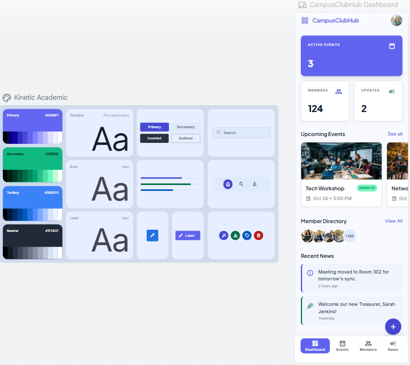
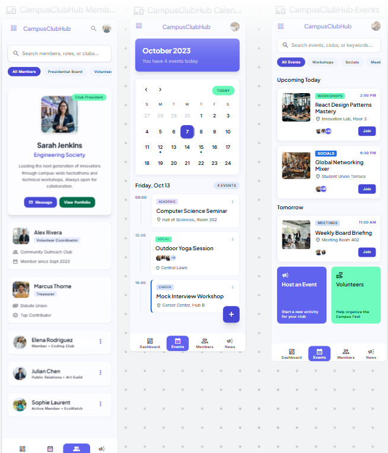
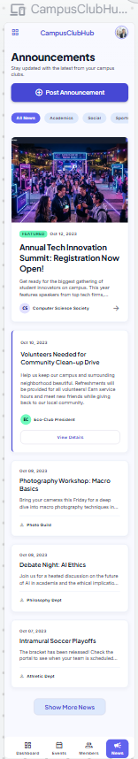
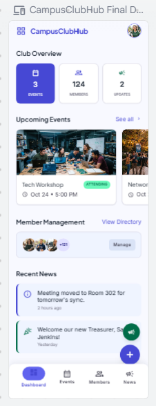

[Back to Main Doc](../../README.md)

# Task A — Google Stitch GUI Design

For Task A, I used Google Stitch to create a GUI design for CampusClubHub.

This GUI belongs to the project idea that I continue in Task B using Lovable.

I used Google Stitch first because I wanted a visual plan before expanding the app in Lovable.

## Tool Used

**Google Stitch** was used to generate the first GUI idea.

## App Idea

The app idea is called **CampusClubHub**.

It is a student club management app.

The planned app should support:

* viewing a club dashboard
* viewing upcoming events
* creating events
* viewing members
* posting announcements
* viewing event sign-up status
* using simple navigation

## Why I Chose This App

I chose CampusClubHub because Task B asks for a middle-sized pet project.

An app for a club fits the task well because it can have several sections, not just one simple page.

It can include events, members, announcements, calendar and sign-ups.

## Design Process

I started with a general prompt for a student club management app.

Then I refined the prompt to make the app feel more like a middle-sized pet project.

After that, I adjusted the design so it could be continued in Lovable for Task B.

## Evidence

* [Prompts](prompts.md)
* [Screenshots](screenshots/)

## Screenshots

### Prompt 1

### Prompt 2

### Google Stitch Design Result

### Generated Code

[Generated Code](stitch-generated-code)

## Connection to Task B

This Google Stitch design is the starting point for Task B.

In Task B, I will use Lovable to continue this idea and turn it into a bigger pet project prototype.

The goal is not to make Task A and Task B separate random ideas. The Google Stitch design from Task A gives me the visual direction for the Lovable project in Task B.

## Short Personal Reflection

Google Stitch helped me create the first visual version of the app.

It was useful because I could see the layout before moving into Lovable.

The design gave me a clearer idea of what CampusClubHub should contain, especially the dashboard, events, members and announcements.