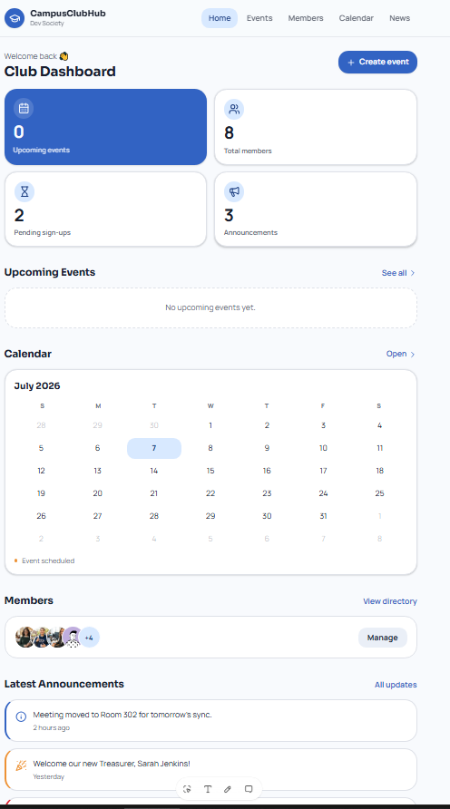
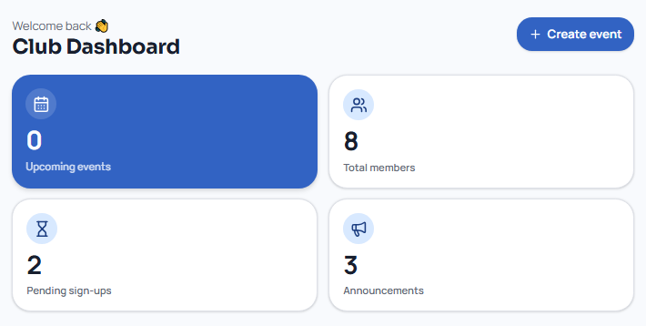
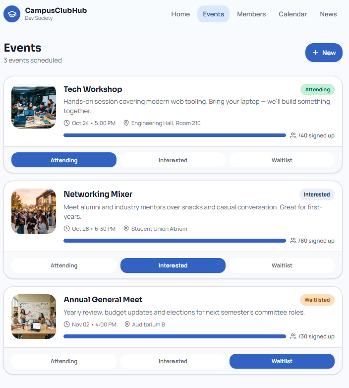
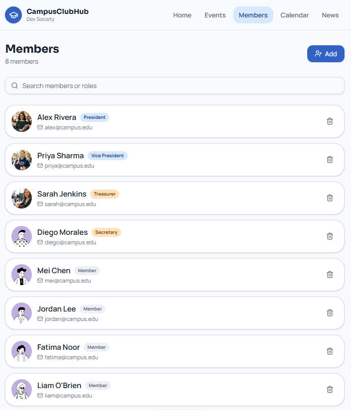
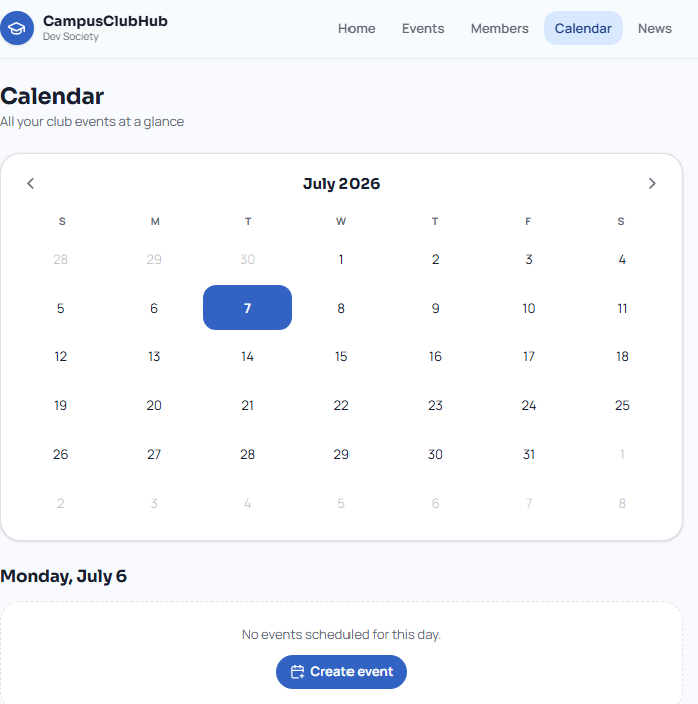
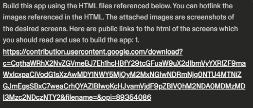

[Back to Main Doc](../../README.md)

# Task B — Lovable Middle-Sized Pet Project

For Task B, I used Lovable to create a middle-sized pet project called CampusClubHub.

CampusClubHub is a student club management app. I chose this idea because the task suggested examples like an app for a club, and this idea has more features than a small ToDo list.

CampusClubHub Lovable Website: https://campusclubhub.lovable.app

## Tool Used

**Lovable** was used for this task.

I used Lovable to continue the CampusClubHub idea that started in Task A with Google Stitch.

## App Idea

CampusClubHub is made for a student club.

The app should help a club manage:

* events
* members
* announcements
* event sign-ups
* calendar overview
* dashboard information

## Why This Counts as a Middle-Sized Pet Project

I think CampusClubHub fits the middle-sized pet project requirement because it has several sections.

It is not only one small page.

The app includes:

* dashboard
* events page
* members page
* announcements section
* calendar section
* sign-up status

This makes it larger than a very small ToDo app, but still simple enough to understand and explain.

## Connection to Task A

Task A was the first GUI design made with Google Stitch.

For Task B, I used Lovable to continue the same app idea and make it feel more complete.

The Google Stitch design helped me decide the basic layout before expanding the idea in Lovable.

## Evidence

* [Prompts](prompts.md)
* [Feature list](features.md)
* [Development log](development-log.md)
* [Screenshots](screenshots/)

## Screenshots

### Start Page

### Dashboard

### Events Page

### Members Page

### Calendar Page

### Import from Stitch prompt

## Short Personal Reflection

Lovable helped me quickly turn the CampusClubHub idea into a bigger app prototype.

It was useful because I could see how the project might look with multiple sections instead of only one screen.

I did not treat the Lovable result as final production code. I used it as evidence for vibe coding and as a way to explore the project idea.