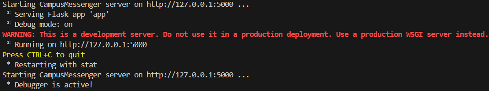
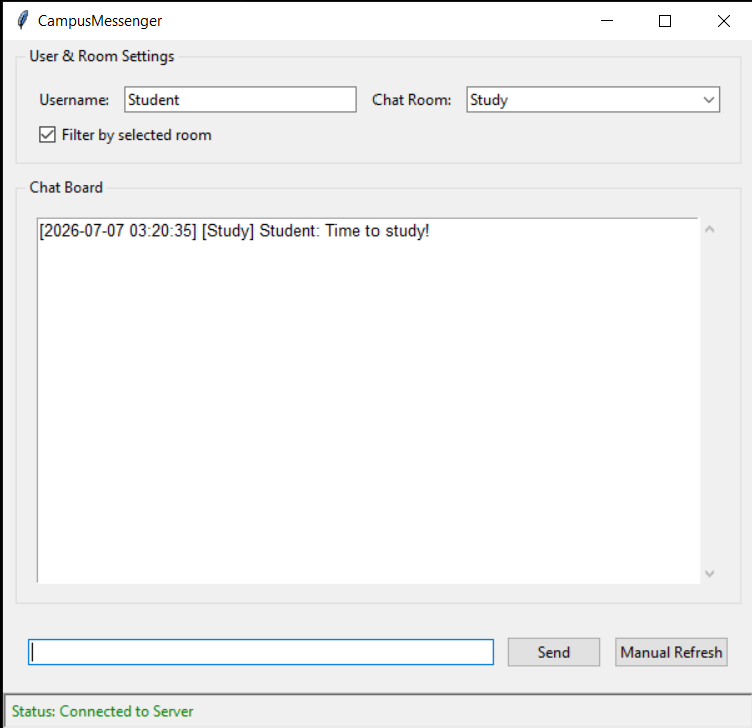
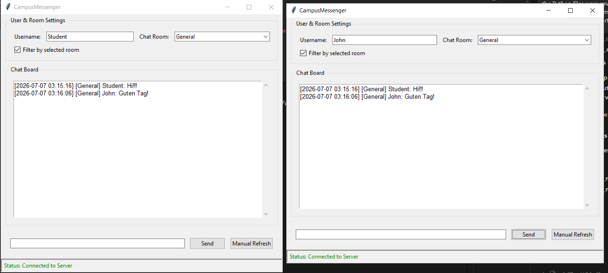
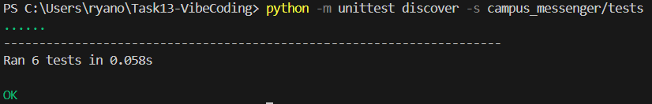

[Back to Main Doc](../../README.md)

# Task C — CampusMessenger Distributed App

For Task C, I built a distributed Python app called CampusMessenger.

CampusMessenger is a simple student messenger app. I chose this idea because the task mentioned a messenger as an example, and it works well as a distributed app.

The goal was to build something with separate modules that I can understand and explain.

## Tool Used

**Google Antigravity IDE** was used for this task.

I used Antigravity as the Visual Studio Code clone / coding agent for building the CampusMessenger app.

## App Idea

CampusMessenger is made for simple student communication.

The app should allow users to:

* enter a username
* choose a chat room
* send messages
* view messages
* refresh messages
* filter messages by room
* store messages in a JSON file

## Why This Counts as a Distributed App

CampusMessenger is not only one local script.

The app is split into a client side and a server side.

The GUI client does not save messages directly. Instead, it sends requests to the Flask server.

The app works like this:

```text
Tkinter GUI Client
    ↓
API Client
    ↓ HTTP requests
Flask Server
    ↓
Message Routes
    ↓
Message Service
    ↓
Message Storage
    ↓
JSON file
```
## Markdown Files

[Implementation Plan](output/implementation_plan.md)

[Walkthrough](output/walkthrough.md)

[Task List](output/task.md)

## Screenshots

### Google Antigravity Used


### Antigravity Implementation Plan


### AI Prompt / Suggestion Used


### Project Structure


### Server Running



### Client Running



### Client Connected to Server



### Tests Passed

