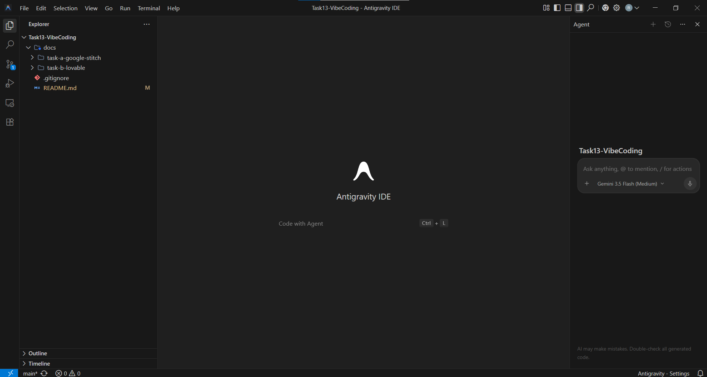
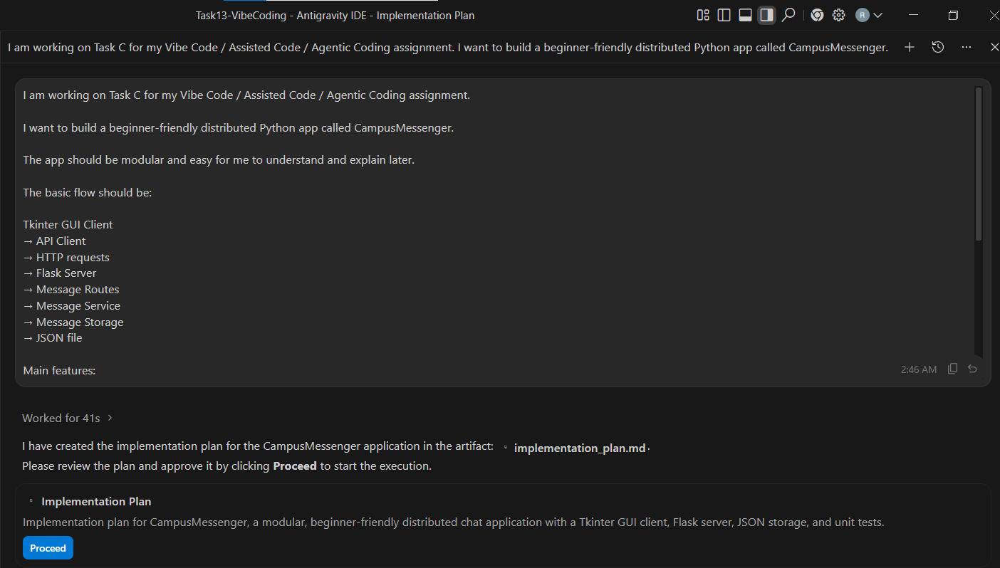
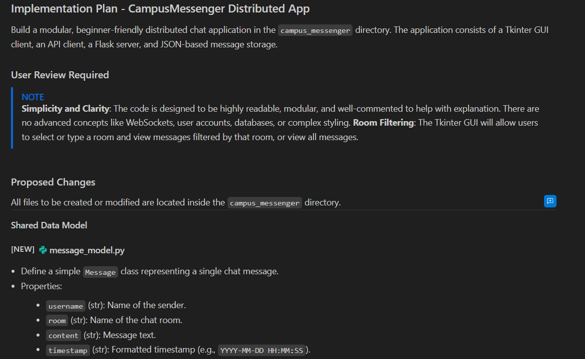
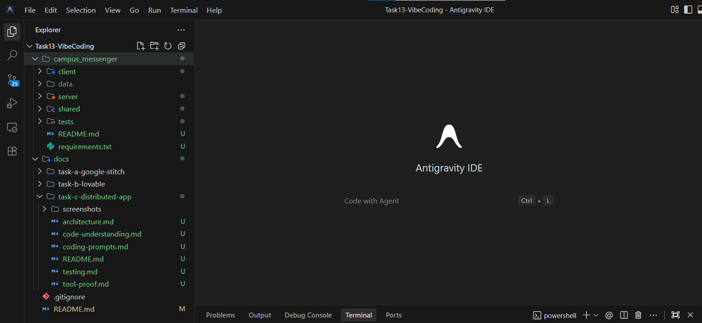

[Back to Task C](README.md)

# Task C - Tool Proof

This file shows which AI coding tool I used for Task C.

For Task C, I used **Google Antigravity IDE**.

I used it as my coding agent / Visual Studio Code clone to build the CampusMessenger app.

## Tool Used

The main tool I used was:

```text
Google Antigravity IDE
```

I used it for:

* creating the CampusMessenger app structure
* generating the first implementation plan
* creating the Python files
* checking the app structure
* helping with tests
* explaining the files

## Why I Used Google Antigravity

The task asks for a CLI or Visual Studio Code clone / derivative.

I chose Google Antigravity because it works like a coding IDE and includes an AI coding agent.

This made it useful for Task C because I could work inside the repo and use the coding agent while building the app.

## Screenshot Evidence

### Google Antigravity Used



This screenshot shows the project opened in Google Antigravity.

### AI Prompt / Suggestion Used



This screenshot shows the prompt I used to ask Antigravity to create the CampusMessenger app.

### Antigravity Implementation Plan



This screenshot shows the implementation plan that Antigravity created before coding.

### Project Structure



This screenshot shows the created `campus_messenger` folder structure.

## What Antigravity Helped With

Antigravity helped me create the first version of the CampusMessenger app.

The generated plan separated the project into:

* client
* server
* routes
* services
* storage
* shared model
* tests

This helped me keep the app modular instead of putting everything into one file.

## What I Checked Myself

After Antigravity generated the app, I checked that the project could run.

I tested:

* the service and storage tests
* the Flask server
* the GUI client
* two clients connected to the same server

The most important check was opening two clients and seeing that both clients could view the same messages.

## Short Personal Reflection

Using Antigravity was useful because it helped me start the project structure quickly.

I still had to run the app, test it and understand what the files do.

For this task, I used the tool as support, but I kept the app simple so I could explain the code myself.